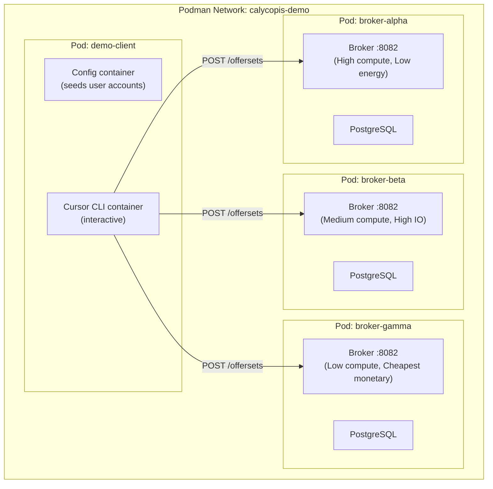

<!-- a14b4c80-cdc0-4be3-a1db-66ca2b3386b5 -->
---
todos:
  - id: "config-properties"
    content: "Create CostsAndMetricsSettings interface and Spring @ConfigurationProperties implementation with nested cost/metric item structures"
    status: pending
  - id: "update-platforms"
    content: "Update DockerPlatformImpl and MockPlatformImpl to read cost/metric values from injected settings instead of hardcoded literals"
    status: pending
  - id: "application-yaml"
    content: "Add optional:file:/etc/calycopis/platform.yaml to config imports and add default cost/metric values to application.yaml"
    status: pending
  - id: "broker-profiles"
    content: "Create three platform.yaml config files in demo/config/ with distinct cost/metric profiles (alpha=HPC, beta=cloud, gamma=budget)"
    status: pending
  - id: "broker-image"
    content: "Build the Spring Boot JAR and broker container image using existing java-runtime Dockerfile"
    status: pending
  - id: "deploy-script"
    content: "Create demo/bin/deploy.sh: Podman network, three broker pods with PostgreSQL, client pod, credential generation"
    status: pending
  - id: "teardown-script"
    content: "Create demo/bin/teardown.sh to stop and remove all pods and the network"
    status: pending
  - id: "configure-script"
    content: "Create demo/bin/configure.sh to seed demo user accounts on all three brokers"
    status: pending
  - id: "client-dockerfile"
    content: "Create demo/docker/demo-client/Dockerfile with Python, calycopis_schema_client, and Cursor CLI"
    status: pending
  - id: "user-agent-md"
    content: "Create demo/USER-AGENT.md with agent instructions: broker endpoints, Python code patterns, comparison table format, offer management workflow"
    status: pending
  - id: "smoke-test"
    content: "Create demo/bin/smoke-test.sh to verify all three brokers return offers with distinct cost/metric values"
    status: pending
  - id: "demo-readme"
    content: "Create demo/README.md documenting the full deployment and demonstration procedure"
    status: pending
isProject: false
---
# Multi-Broker Costs and Metrics Demonstration

## Architecture



The three broker pods each run a PostgreSQL container and a broker container with the `docker` Spring profile. Each broker has different cost and metric values loaded from external YAML configuration. The client pod runs Cursor CLI in an interactive container with a `USER-AGENT.md` that guides the AI in managing tasks across all three brokers.

---

## Phase 1: Externalize cost/metric configuration

Currently, cost and metric values are hardcoded in `populateCostsAndMetrics()` in both platform implementations. We need to externalize them via Spring `@ConfigurationProperties` so the same Docker image can be configured differently per broker.

### 1a. Create a configuration properties class

New file: `spring/platform/CostsAndMetricsSettingsImpl.java`

Following the existing pattern in [`DockerPlatformSettingsImpl.java`](java/src/main/java/net/ivoa/calycopis/broker/spring/platform/docker/DockerPlatformSettingsImpl.java), create a `@ConfigurationProperties(prefix = "broker.costs-and-metrics")` class that binds a structured YAML config:

```yaml
broker:
  costs-and-metrics:
    session:
      costs:
        - type: "urn:ivoa:calycopis:cost:monetary"
          description: "Estimated monetary cost"
          min: 0.10
          max: 0.50
        - type: "urn:ivoa:calycopis:cost:energy"
          description: "Estimated energy use in kWh"
          min: 0.02
          max: 0.10
        - type: "urn:ivoa:calycopis:cost:carbon"
          description: "Estimated carbon emissions in gCO2"
          min: 5.0
          max: 25.0
      metrics:
        - type: "urn:ivoa:calycopis:metric:compute-performance"
          description: "Compute performance benchmark"
          min: 150.0
          max: 200.0
    compute:
      costs:
        - type: "urn:ivoa:calycopis:cost:monetary"
          description: "Compute cost per hour"
          min: 0.05
          max: 0.25
      metrics:
        - type: "urn:ivoa:calycopis:metric:compute-performance"
          description: "CPU benchmark score"
          min: 150.0
          max: 200.0
        - type: "urn:ivoa:calycopis:metric:io-throughput"
          description: "IO throughput in MB/s"
          min: 100.0
          max: 500.0
```

The class needs:
- A nested `CostMetricItem` record/class with `type`, `description`, `min`, `max` fields
- A nested `ComponentConfig` class with `List<CostMetricItem> costs` and `List<CostMetricItem> metrics`
- Top-level `session` and `compute` fields of type `ComponentConfig`

### 1b. Create interface in engine package

New file: `engine/functional/platform/CostsAndMetricsSettings.java`

An interface matching the settings class (following the `DockerPlatformSettings` / `DockerPlatformSettingsImpl` split between `engine/` and `spring/` packages per the coding standards).

### 1c. Update platform implementations

Modify [`DockerPlatformImpl.populateCostsAndMetrics()`](java/src/main/java/net/ivoa/calycopis/broker/spring/platform/docker/DockerPlatformImpl.java) and [`MockPlatformImpl.populateCostsAndMetrics()`](java/src/main/java/net/ivoa/calycopis/broker/spring/platform/mock/MockPlatformImpl.java) to read from the injected settings rather than using hardcoded values. The existing hardcoded values become defaults in `application.yaml`.

### 1d. Add a config import for the platform config

Add `optional:file:/etc/calycopis/platform.yaml` to the `spring.config.import` list in [`application.yaml`](java/src/main/resources/application.yaml). Using `optional:` means the broker still starts without the file (using defaults).

---

## Phase 2: Create per-broker configuration profiles

Three YAML config files defining different cost/metric profiles:

- **broker-alpha** -- "Green HPC": Highest compute performance (250-300), highest IO (800-1200 MB/s), moderate monetary cost (0.30-0.80), lowest energy (0.01-0.03 kWh), lowest carbon (2-8 gCO2)
- **broker-beta** -- "General Purpose Cloud": Medium compute (120-160), medium IO (200-400 MB/s), lowest monetary cost (0.05-0.15), medium energy (0.05-0.15 kWh), medium carbon (15-40 gCO2)
- **broker-gamma** -- "Budget Tier": Lowest compute (60-90), lowest IO (50-100 MB/s), cheapest monetary (0.02-0.08), highest energy (0.10-0.30 kWh), highest carbon (30-80 gCO2)

These files go in a new directory: `demo/config/`

- `demo/config/broker-alpha/platform.yaml`
- `demo/config/broker-beta/platform.yaml`
- `demo/config/broker-gamma/platform.yaml`

---

## Phase 3: Build broker container image

### 3a. Build the Spring Boot JAR

From the broker project root, build the fat JAR with the docker platform profile:

```bash
cd java
./mvnw clean package -DskipTests -D calycopis-platform=docker
```

### 3b. Build the runtime image

Using the existing [`docker/java-runtime/Dockerfile`](docker/java-runtime/Dockerfile), build the image:

```bash
podman build \
    --build-arg jarfile=calycopis-broker-1.0.6-SNAPSHOT.jar \
    --tag calycopis/broker:latest \
    -f docker/java-runtime/Dockerfile \
    java/target/
```

---

## Phase 4: Podman deployment infrastructure

### 4a. Create deployment script

New file: `demo/bin/deploy.sh`

This script:
1. Creates the shared Podman network: `podman network create calycopis-demo`
2. For each broker (alpha, beta, gamma):
   - Generates database and admin credentials with `pwgen`
   - Creates the pod: `podman pod create --name broker-{name} --network calycopis-demo`
   - Starts PostgreSQL in the pod
   - Copies config files (database.yaml, admin.yaml, platform.yaml) into the broker container
   - Starts the broker container in the pod, mounting `/etc/calycopis/` from a generated config directory
3. Creates the client pod: `podman pod create --name demo-client --network calycopis-demo`
4. Waits for all three brokers to respond on their health endpoints
5. Writes a `demo-env.sh` file with all broker URLs and admin credentials

### 4b. Network topology

Each broker pod exposes port 8082 internally. Within the Podman network, the brokers are addressable as:
- `http://broker-alpha:8082`
- `http://broker-beta:8082`
- `http://broker-gamma:8082`

### 4c. Create teardown script

New file: `demo/bin/teardown.sh`

Stops and removes all pods and the network.

---

## Phase 5: Configuration script

New file: `demo/bin/configure.sh`

This runs inside the client pod (or is exec'd into a container in that pod). It:
1. Sources `demo-env.sh` for broker URLs and admin credentials
2. For each broker, uses `curl` or the Python client to `POST /admin/identities` and create a demo user account (same username/password on all three brokers for convenience)
3. Writes a `demo-user.env` file with the demo user credentials and broker URLs

---

## Phase 6: Create USER-AGENT.md

New file: `demo/USER-AGENT.md`

This is the Cursor agent instruction file (placed in the working directory so Cursor CLI reads it as `AGENTS.md`). It defines the agent's capabilities and behavior:

### Content outline

1. **Role**: "You are a scientific computing task manager. You help users submit computational tasks to execution brokers, compare offers, and manage executions."

2. **Available brokers**: Lists the three broker endpoints with their profiles (Green HPC, General Purpose Cloud, Budget Tier). Read from environment or a config file.

3. **Tools and libraries**: The agent has access to:
   - Python 3 with `calycopis_schema_client` installed
   - The `ExecutionBrokerClient` class and its methods (`submit_execution`, `get_session`, `set_session_phase`, `wait_for_phase`)
   - Shell access for running Python scripts

4. **Capabilities the agent should offer**:
   - **Create task**: Build an `ExecutionRequest` from a user's description (Docker image, compute requirements, data resources)
   - **Submit to all brokers**: Send the request to all three brokers and collect `OfferSetResponse`s
   - **Compare offers**: Present a summary table showing each broker's costs (monetary, energy, carbon) and metrics (compute performance, IO throughput) side by side
   - **Accept an offer**: Call `set_session_phase(uuid, "ACCEPTED")` on the chosen offer
   - **Monitor execution**: Poll `get_session()` and report phase transitions
   - **Display results**: Show the final status, connectors, and any messages

5. **Example interaction patterns**: Scripted examples showing the user asking "Run an Alpine container that computes pi to 1000 digits" and the agent creating the request, submitting, comparing, and managing the result.

6. **Code patterns**: Include the Python code snippets for connecting to brokers, creating requests, and comparing offers, so the agent can adapt them.

---

## Phase 7: Client container

### 7a. Create client Dockerfile

New file: `demo/docker/demo-client/Dockerfile`

Based on `calycopis/developer-tools` or a simpler Fedora/Ubuntu base. Installs:
- Python 3 + pip
- `calycopis_schema_client` package (from the built wheel)
- Cursor CLI (via the official install script or npm)
- `pwgen`, `curl`, `jq`, `yq` for the configuration script

### 7b. Run the client container

The deployment script starts an interactive container in the client pod:

```bash
podman run -it \
    --pod demo-client \
    --volume ./demo:/workspace:z \
    --env-file demo-user.env \
    calycopis/demo-client:latest \
    /bin/bash
```

Inside this container, the user:
1. Authenticates Cursor CLI (one-time `cursor auth login`)
2. Runs `cursor` (or `cursor agent`) in the `/workspace` directory where `AGENTS.md` (the USER-AGENT.md) is present
3. Interacts with the agent via text

---

## Phase 8: Demo verification

### 8a. Automated smoke test

New file: `demo/bin/smoke-test.sh`

A script that:
1. Submits a test request to each broker via curl/Python
2. Verifies each returns offers with different cost/metric values
3. Accepts one offer and waits for completion

### 8b. Demo scenario

A documented walkthrough (in `demo/README.md`) of the intended demonstration:

1. User: "Run a Docker container that generates 1000 random numbers and computes statistics"
2. Agent creates the ExecutionRequest and submits to all three brokers
3. Agent presents comparison:
   - Alpha: Fast (score 275), green (5 gCO2), costs $0.55
   - Beta: Medium (score 140), moderate (28 gCO2), costs $0.10
   - Gamma: Slow (score 75), dirty (55 gCO2), costs $0.05
4. User selects based on preference (fastest, cheapest, greenest)
5. Agent accepts and monitors to completion

---

## File summary

New files to create:
- `java/.../engine/functional/platform/CostsAndMetricsSettings.java` (interface)
- `java/.../spring/platform/CostsAndMetricsSettingsImpl.java` (Spring config binding)
- `demo/config/broker-alpha/platform.yaml`
- `demo/config/broker-beta/platform.yaml`
- `demo/config/broker-gamma/platform.yaml`
- `demo/docker/demo-client/Dockerfile`
- `demo/bin/deploy.sh`
- `demo/bin/teardown.sh`
- `demo/bin/configure.sh`
- `demo/bin/smoke-test.sh`
- `demo/USER-AGENT.md`
- `demo/README.md`

Files to modify:
- `java/.../spring/platform/docker/DockerPlatformImpl.java` (use config instead of hardcoded values)
- `java/.../spring/platform/mock/MockPlatformImpl.java` (use config instead of hardcoded values)
- `java/src/main/resources/application.yaml` (add platform.yaml import, default cost/metric values)
