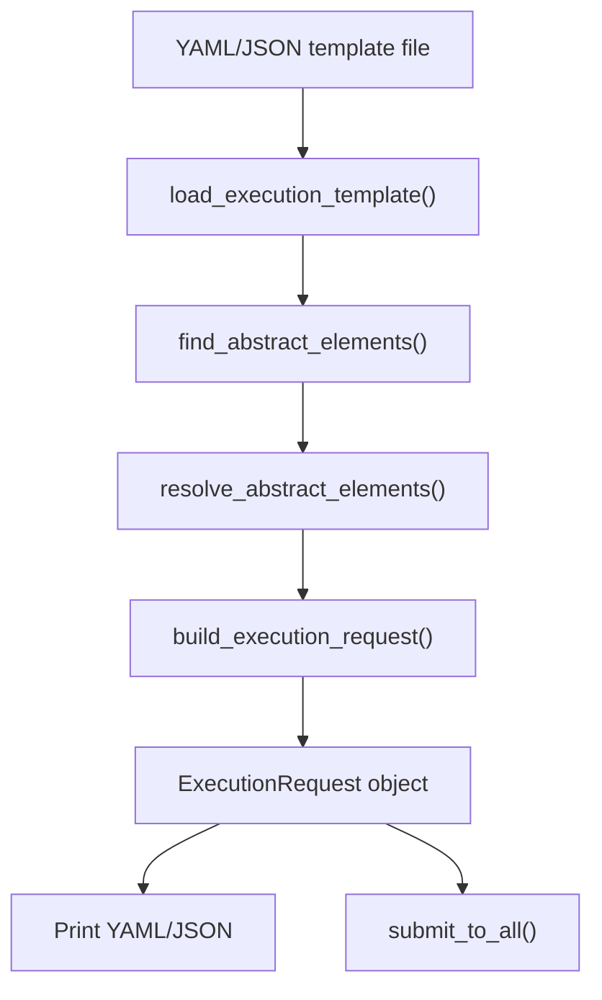

<!-- f96e072b-4e66-40f7-8767-ff6d269ced86 -->
---
todos:
  - id: "builder-module"
    content: "Create `demo/bin/broker_tools/builder.py` with the kind registry, template loader, abstract element detector, interactive resolver, and request builder functions"
    status: pending
  - id: "update-init"
    content: "Update `demo/bin/broker_tools/__init__.py` to export the new builder functions"
    status: pending
  - id: "add-cli-command"
    content: "Add the `build` subcommand to `demo/bin/broker` CLI with --template, --submit, --state, and --json flags"
    status: pending
  - id: "test-with-template"
    content: "Verify the builder works with the Heliophorus-androcles ivoa-execution.yaml template end-to-end"
    status: pending
isProject: false
---
# Request Builder Tool Plan

## Context

The existing CLI at [demo/bin/broker](demo/bin/broker) builds requests entirely from CLI flags (`--image`, `--command`, `--cores`), which only supports Docker containers. The new builder reads structured YAML/JSON templates like [/heliophorus/Heliophorus-androcles/github-zrq/ivoa-execution.yaml](/heliophorus/Heliophorus-androcles/github-zrq/ivoa-execution.yaml), which can describe any combination of executables, compute, storage, volumes, and data resources -- including abstract placeholders that need user input.

## Architecture



The builder has two layers:

- **Programmatic API** (in `builder.py`): Pure functions that load templates, detect abstract elements, accept replacement dicts, and return `ExecutionRequest` objects. An AI agent or script can call these directly without any interactive prompts.
- **Interactive CLI** (in `broker` script): Wraps the programmatic API with `input()` prompts when abstract elements have no replacement provided.

## Kind URI Registry

A central mapping from `kind` URIs to wrapper classes (from `calycopis_schema_client.wrappers`). Each entry records whether the kind is abstract or concrete. The registry covers all discriminator families:

- **Executables**: `abstract-executable` (abstract), `docker-container`, `singularity-container`, `jupyter-notebook`
- **Compute**: `abstract-compute-resource` (abstract), `simple-compute-resource`
- **Storage**: `abstract-storage-resource` (abstract), `simple-storage-resource`
- **Volumes**: `abstract-volume-mount` (abstract), `simple-volume-mount`
- **Data**: `abstract-data-resource` (abstract), `simple-data-resource`, `S3-data-resource`, `rucio-data-resource`, `ivoa-data-resource`, `skao-data-resource`

When a kind URI is abstract, `find_abstract_elements()` flags it with the element's path (e.g. `data[0]`), the element's `meta.name` and `meta.description`, and the list of concrete alternatives for that family.

## Conversion Logic

Each YAML component is converted to its Python model class:

- The `kind` field selects the wrapper class (which already provides the correct default `kind`)
- `meta` maps to `ComponentMetadata`
- Nested fields like `image` map to `DockerImageSpec`, `volumes` entries map to `SimpleVolumeMount`, etc.
- The conversion uses the Pydantic `model_validate()` method on the selected wrapper class, passing the raw dict from YAML. This leverages the generated models' existing field definitions rather than manual field-by-field mapping.

For abstract elements, the user (or AI agent) provides a replacement dict specifying the concrete `kind` and any required fields. For `simple-data-resource`, the minimum required field is `location` (a URL).

## Interactive Resolution Flow

When the builder encounters an abstract element and no replacement is provided:

1. Display the element path, name, and description from the template
2. Present the available concrete types for that family
3. After the user selects a type, prompt for the required fields of that type (e.g. `location` for `SimpleDataResource`, `endpoint`/`bucket`/`object` for `S3DataResource`)
4. Preserve any existing `meta` (name, description) from the abstract placeholder

## Files to Create/Modify

### New: [demo/bin/broker_tools/builder.py](demo/bin/broker_tools/builder.py)

Core builder module with these public functions:

- `load_execution_template(path: str | Path) -> dict` -- Load a YAML or JSON file, stripping the `#` licence/meta header comment block, and returning the raw dict. Detects format from file extension.
- `find_abstract_elements(template: dict) -> list[AbstractElementInfo]` -- Walk the template dict, check `kind` fields against the registry, return a list of `AbstractElementInfo` named tuples with `(path, kind, name, description, concrete_alternatives)`.
- `resolve_abstract_interactively(element: AbstractElementInfo) -> dict` -- Interactive prompts (via `input()`) to choose a concrete type and fill in its required fields. Returns the replacement dict.
- `build_execution_request(template: dict, replacements: dict | None = None) -> ExecutionRequest` -- Convert the template dict into an `ExecutionRequest`, applying any replacements for abstract elements. The `replacements` dict is keyed by element path (e.g. `"data[0]"`) with values being dicts of overriding fields (including `kind`).
- `format_request_yaml(request: ExecutionRequest) -> str` -- Serialize the request back to YAML for review.

### Modify: [demo/bin/broker_tools/__init__.py](demo/bin/broker_tools/__init__.py)

Export the new public functions: `load_execution_template`, `find_abstract_elements`, `resolve_abstract_interactively`, `build_execution_request`, `format_request_yaml`.

### Modify: [demo/bin/broker](demo/bin/broker)

Add a `build` subcommand:

```
broker build --template PATH [--submit] [--state PATH] [--json]
```

- `--template PATH` -- Path to a YAML or JSON execution template
- `--submit` -- After building, submit to all brokers and display comparison (reuses `submit_to_all()`)
- `--state PATH` -- State file path (used with `--submit`)
- `--json` -- Output as JSON instead of YAML

Without `--submit`, the command loads the template, resolves any abstract elements interactively, prints the completed request as YAML (or JSON), and exits. With `--submit`, it also submits to all brokers using the existing comparison flow.

## Handling the Template Format

The YAML template uses bare top-level keys (`executable`, `compute`, `data`) which map directly to `ExecutionRequest` fields. The `kind` field on each component uses the full discriminator URI. The builder strips the licence/AIMetrics comment block before YAML parsing (everything before the first non-comment, non-blank line).

## Dependencies

- `pyyaml` -- already available (used elsewhere in the project)
- No new external dependencies required
